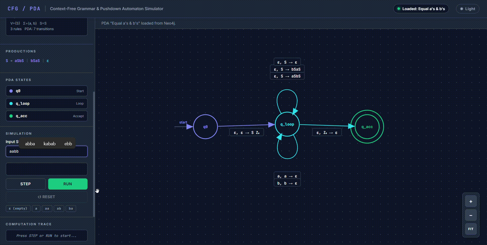

# CFG / PDA Simulator (Neo4j Powered)

A comprehensive, single-page web application for visually designing Context-Free Grammars (CFG) and simulating their corresponding Pushdown Automata (PDA) using a Neo4j graph database backend.

## Features

- **CFG to PDA Transformation**: Visually design your Context-Free Grammars and automatically generate the corresponding Pushdown Automaton.
- **Neo4j Integration**: Connects directly to a Neo4j database using the browser-based Javascript driver to persistently store your automata.
- **In-Browser Grammar Editor**: A built-in modal to define Variables, Terminals, Start Symbols, and Production Rules interactively.
- **Interactive Stack Simulation**: Step-by-step trace simulation with visual feedback of the current state, input string processing, and live stack operations.
- **Local Import / Export**: Export and import grammar rules as `.cfg` files to persist your work across sessions without needing a database.

---

## Why Export/Import .cfg Files?

The simulator can store your complete PDA definitions and CFG rules inside a Neo4j Graph Database. However, you might want to work offline or share your grammar with someone who doesn't have access to your database.

**Why use the Export/Import feature?**
By exporting your grammar to a `.cfg` (JSON-formatted) file, you can permanently save the exact variables, terminals, and production rules locally. When you return to the simulator, simply import the `.cfg` file to instantly reconstruct the CFG and regenerate the PDA logic.

---

## Prerequisites: Neo4j Installation

To save and load your PDAs using the database features, you need an active Neo4j database running either locally or in the cloud.

### Local Installation (Neo4j Desktop)
1. Download [Neo4j Desktop](https://neo4j.com/download/) and install it on your machine.
2. Open Neo4j Desktop and create a new **Local DBMS**.
3. Set the password for the default `neo4j` user.
4. Click **Start** to run the database. The default connection URI is usually `bolt://127.0.0.1:7687` or `neo4j://127.0.0.1:7687`.

### Alternative: Neo4j AuraDB (Cloud)
If you prefer not to install anything, you can use [Neo4j AuraDB](https://neo4j.com/cloud/platform/aura-graph-database/) to create a free cloud instance. You will receive a connection URI (e.g., `neo4j+s://<id>.databases.neo4j.io`) and a password.

---

## How to Use the Simulator

### 1. Connecting to the Database
1. Open the `index.html` file in any modern web browser.
2. In the **Neo4j Database** panel on the left sidebar, enter your Database URI, Username (usually `neo4j`), and Password.
3. Click **⚡ CONNECT**.

### 2. Creating a New CFG & PDA
1. Click **＋ CREATE / EDIT GRAMMAR**.
2. **Define Alphabet**: Set up your Variables (Non-terminals) and Terminals.
3. **Production Rules**: Specify the start symbol and add your production rules (e.g., `S -> aSb | ε`).
4. **Save**: Click **☁ Save** to store the generated PDA into your connected Neo4j database, or use **↓ CFG** to download it locally.

### 3. Simulating Strings
1. Select a saved PDA from the **Saved PDAs** dropdown and click **▶ LOAD**.
2. In the **Simulation** section, enter the input string you want to test (or `ε` for empty).
3. Use the **STEP** button to process the string character by character, or click **RUN** to execute the entire simulation automatically.
4. The Computation Trace and Stack display will update in real-time, showing push/pop operations, state transitions, and the final `Accept` or `Reject` result.

### 4. Customizing the View
- Use the **Light/Dark theme toggle** in the top right to match your preference.
- Pan around the canvas area by clicking and dragging.
- Use the floating controls on the canvas to zoom in, zoom out, or fit the automaton to the screen.

---

## Graph Database Schema Reference

For developers and database administrators, the application creates and queries the following schema in Neo4j:

- **`(p:PDA)` Nodes**: 
  - Properties: `id`, `name`, `desc`, `startState`, `acceptStates`, `stackBottom`, `inputAlpha`, `stackAlpha`.
  - Also stores raw CFG data as properties: `cfgVariables`, `cfgTerminals`, `cfgStart`, `cfgProductions`.
- **`(s:PDAState)` Nodes**:
  - Properties: `name`, `pdaId`, `isStart` (Boolean), `isAccept` (Boolean).
- **`[:HAS_STATE]` Relationships**:
  - Links a `PDA` to its `PDAState` nodes. `(p)-[:HAS_STATE]->(s)`
- **`[:PDA_TRANSITION]` Relationships**:
  - Links two `PDAState` nodes. 
  - Properties: `inp` (Input symbol), `pop` (Stack symbol to pop), `push` (Stack symbols to push), `type`, `rule`.
  - Represents a transition operation on the pushdown automaton.

---

## License

This project is licensed under the [MIT License](LICENSE).
